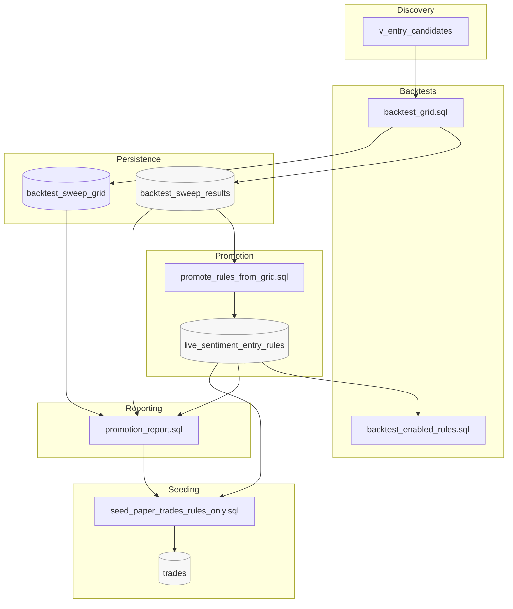

# Backtesting + Promotion Pipeline

This document explains how the core SQL scripts fit together to discover, evaluate, promote, and seed rules into paper trades.

## Overview

- Discovery produces candidate entry signals per day/symbol/side/horizon.
- Backtests score candidates or rules over a window and can sweep thresholds.
- Winners are persisted and optionally promoted to live rules.
- Paper trades are seeded from promoted rules for operational validation.

## Diagram



## Stages and Artifacts

- Discovery: candidates view
  - Source: Typically materialized as `v_entry_candidates` (from prior scoring + heuristics).
  - Output: Per-day candidates with scores, margins, thresholds.

- Enabled Rules Backtest
  - Script: `backtest_enabled_rules.sql` (or `backtest_enabled_rules_v1.sql`)
  - Input: `live_sentiment_entry_rules` (is_enabled = true)
  - Output: Aggregated performance and optional persistence to `backtest_sweep_results`.

- Grid Backtest (sweep)
  - Script: `moonshot-memestock-hub/reddit-utils/backtest_grid.sql`
  - Input: Scored mentions + prices; sweeps `min_mentions` and `pos_thresh` across horizons/sides.
  - Output: Full in-session grid (`tmp_results`), optional full-grid persistence to `backtest_sweep_grid`, and persisted winners (one per symbol/horizon/side) to `backtest_sweep_results`.
  - Diagnostics in output/CSV: `band`, `train_trades`, `valid_trades`, `train_sharpe`, `valid_sharpe`, `r_train_rank`, `r_valid_rank`.
  - Optional: Client-side CSV export via `COPY ... TO STDOUT` + `\g :CSV_PATH`.

- Promotion from Grid
  - Script: `moonshot-memestock-hub/reddit-utils/promote_rules_from_grid.sql`
  - Input: `backtest_sweep_results` (window, model_version)
  - Logic: Hard filters (min trades/sharpe/win/avg) and optional robustness check; upsert into `live_sentiment_entry_rules` with provenance note.
  - Output: New/updated enabled rules for the window with metrics embedded.

- Promotion Report
  - Script: `moonshot-memestock-hub/reddit-utils/promotion_report.sql`
  - Inputs: `backtest_sweep_results`, optional full sweep data, and the promoted rules set (`live_sentiment_entry_rules`).
  - Output: Aggregated guardrails showing `n_rules`, Sharpe averages, FDR pass counts (`n_q_pass`), and brittleness counts per horizon/side to gate seeding.

- Seed Paper Trades (rules-only)
  - Script: `moonshot-memestock-hub/reddit-utils/seed_paper_trades_rules_only.sql`
  - Input: `v_entry_candidates` filtered to model/window; priced from `enhanced_market_data`.
  - Output: Inserts into `trades` with `mode='paper'` and `source='rules-backfill-v2'`, deduped by (symbol,side,horizon,trade_date,source).

## Runners and Typical Flow

1) Backtest grid over a window and export CSV if desired

- Runner: `moonshot-memestock-hub/reddit-utils/run_backtest_grid.sh`
- Example:

```
 PGURI="$PGURI" moonshot-memestock-hub/reddit-utils/run_backtest_grid.sh \
  2025-06-01 2025-09-12 /tmp/grid.csv
```

Common optional flags via env:
- Stability: `USE_FOLDS=1`, `FOLD_FRAC=0.70`, `REQUIRE_RANK_CONSISTENT=0`, `RANK_TOP_K=3`
- LB ranking: `LB_Z=1.64`, `USE_LB_RANKING=0/1`, `REQUIRE_LB_POSITIVE=0/1`
- Uplift: `REQUIRE_UPLIFT_POSITIVE=0/1`
- Bands: `BAND_STRONG=0.35`, `BAND_MODERATE=0.20`, `BAND_WEAK=0.10`

2) Promote best grid rules for the window into live rules

- Runner: `moonshot-memestock-hub/reddit-utils/run_promote_rules_from_grid.sh`
- Example:

```
 PGURI="$PGURI" moonshot-memestock-hub/reddit-utils/run_promote_rules_from_grid.sh \
  2025-06-01 2025-09-12 gpt-sent-v1
```

Common optional flags via env:
- Source selection and robustness: `USE_FULL_GRID=0/1`, `NEIGHBOR_POS_EPS`, `NEIGHBOR_MM_EPS`, `MIN_NEIGHBORS`, `SHARPE_FRAC`
- FDR gating: `Q_MAX` (e.g., `0.10` to enable BH FDR)

3) Promotion report for audit and guardrails

- Runner: directly with `promotion_report.sql`
- Example:

```
psql "$PGURI" \
  -v MODEL_VERSION='gpt-sent-v1' \
  -v START_DATE='2025-06-01' -v END_DATE='2025-09-12' \
  -v USE_FULL_GRID=1 -v Q_MAX=0.10 \
  -v NEIGHBOR_POS_EPS=0.05 -v NEIGHBOR_MM_EPS=1 -v SHARPE_FRAC=0.75 \
  -f moonshot-memestock-hub/reddit-utils/promotion_report.sql
```

Use this to review `neighbor_cnt` (brittleness), bands, and `q_value` versus `Q_MAX` before seeding.

Example horizon summary snapshot:

```
Summary by horizon/side:
 horizon | side | n_rules | mean_sharpe | n_q_pass | n_brittle 
---------+------+---------+-------------+----------+-----------
 1d      | LONG |       4 |       0.573 |        4 |         0
 3d      | LONG |       7 |       0.707 |        6 |         1
 5d      | LONG |       5 |       0.874 |        5 |         0
(3 rows)
```

4) Seed paper trades from rules-only candidates to validation trades

- Runner: `moonshot-memestock-hub/reddit-utils/run_seed_paper_trades_rules_only.sh`
- Example:

```
PGURI="$PGURI" moonshot-memestock-hub/reddit-utils/run_seed_paper_trades_rules_only.sh \
  2025-06-01 2025-09-12 gpt-sent-v1
```

Common tweaks:
- Filter low-edge entries with `MIN_MARGIN` (e.g., `MIN_MARGIN=0.01`).
- Raise per-day caps via `DAILY_MAX` only after validating liquidity.

5) Tail review + rule hygiene

- Pull the worst recent exits from `trades` to spot brittle rules before the next cycle.

```
psql "$PGURI" <<'SQL'
WITH realized AS (
  SELECT t.*, CASE WHEN t.exit_price IS NULL THEN NULL ELSE
    CASE WHEN t.side='LONG'
      THEN (t.exit_price - t.entry_price)/NULLIF(t.entry_price,0)
      ELSE (t.entry_price - t.exit_price)/NULLIF(t.entry_price,0)
    END
  END AS realized_pct
  FROM trades t
  WHERE t.source='rules-backfill-v2'
    AND t.mode='paper'
    AND t.model_version='gpt-sent-v1'
    AND t.trade_date BETWEEN DATE '2025-06-01' AND DATE '2025-09-12'
    AND t.status='CLOSED'
)
SELECT symbol, side, horizon, trade_date, realized_pct, notes
FROM realized
ORDER BY realized_pct ASC
LIMIT 25;
SQL
```

- Tighten or disable the offending rules with targeted updates to `live_sentiment_entry_rules` (e.g., raise `min_mentions`, bump `pos_thresh`, or set `is_enabled=false`) and rerun the seeding script.

## Key Parameters (shared conventions)

- Model & window: `MODEL_VERSION`, `START_DATE`, `END_DATE`.
- Grid sweep lists: `MIN_MENTIONS_LIST`, `POS_THRESH_LIST`, `HORIZONS`, `SIDES`.
- Quality gates: `MIN_TRADES`, `MIN_SHARPE`. Optional LB gating `REQUIRE_LB_POSITIVE` with `LB_Z` (default 1.64).
- Baseline uplift gating: `REQUIRE_UPLIFT_POSITIVE`.

## Validation Helpers

- Full-grid parity and diagnostics
  - Script: `validation/validate_full_grid.sql`
  - Purpose: reruns `backtest_grid.sql` in-session, diffing `tmp_results` vs. `backtest_sweep_grid`, checking fold coverage, surfacing LB vs. Sharpe rank flips, and reporting BH FDR acceptance deltas.
  - Example:

    ```bash
    cd "$CODE_DIR/validation" && \
    psql "$PGURI" \
      -v MODEL_VERSION='gpt-sent-v1' \
      -v START_DATE='2025-06-01' \
      -v END_DATE='2025-09-15' \
      -v PERSIST_FULL_GRID=1 \
      -v DO_PERSIST=0 \
      -v USE_FOLDS=1 \
      -v REQUIRE_STABLE=1 \
      -v SHARPE_FRAC=0.70 \
      -v SAMPLE_SYMBOLS='AAPL,TSLA,AMD' \
      -f validate_full_grid.sql \
      > "$WORKING_DIR/logs/validate_full_grid_2025-06-01_2025-09-15.log"
    ```

  - The 2025-06-01→2025-09-15 log confirms `tmp_results_count = persisted_count = 4567`, fold diagnostics on 964 pockets, LB demotions of brittle TSLA/GME rows, and trimmed vs. wide FDR acceptance both equal to 345.

- Winners vs. full-grid neighbor comparison
  - Script: `validation/compare_neighbor_modes.sql`
  - Purpose: replays promotion filters against `backtest_sweep_results` and `backtest_sweep_grid`, emitting summary counts plus `lost_with_full_grid` / `gained_with_full_grid` diffs.
  - Example:

    ```bash
    cd "$CODE_DIR/validation" && \
    psql "$PGURI" \
      -v MODEL_VERSION='gpt-sent-v1' \
      -v START_DATE='2025-06-01' \
      -v END_DATE='2025-09-15' \
      -v MIN_TRADES=10 \
      -v MIN_SHARPE=0.40 \
      -v MIN_WIN_RATE=0.55 \
      -v MIN_AVG_RET=0.00 \
      -v NEIGHBOR_POS_EPS=0.05 \
      -v NEIGHBOR_MM_EPS=1 \
      -v MIN_NEIGHBORS=1 \
      -v SHARPE_FRAC=0.75 \
      -v REQUIRE_ROBUST=1 \
      -v Q_MAX=0.10 \
      -f compare_neighbor_modes.sql \
      > "$WORKING_DIR/logs/compare_neighbor_modes_2025-06-01_2025-09-15.log"
    ```

  - The latest run shows 15 promoted winners vs. 6 full-grid survivors. Full-grid mode drops brittle pockets (e.g., `AAPL 3d LONG 1/0.15`) and admits more robust cells (e.g., `HOOD 1d LONG 1/0.30`, `SOFI 5d LONG 2/0.20`), providing the validation artifact before enabling `USE_FULL_GRID` in promotion.
- Ranking: `USE_LB_RANKING=1` to order by LB instead of Sharpe in outputs/winner previews.
- Folds & stability: `USE_FOLDS` (alias) and/or `REQUIRE_STABLE`, `FOLD_FRAC` (e.g., 0.70), `SHARPE_FRAC`, optional `REQUIRE_RANK_CONSISTENT`, `RANK_TOP_K`.
- Bands: `BAND_STRONG`, `BAND_MODERATE`, `BAND_WEAK` — emitted as `band`.
- Full-grid persistence: `PERSIST_FULL_GRID=1` to populate `backtest_sweep_grid`.
- Promotion robustness (in promotion script): `USE_FULL_GRID`, `NEIGHBOR_POS_EPS`, `NEIGHBOR_MM_EPS`, `MIN_NEIGHBORS`.
- Seeding controls: `DPT` (dollars per trade), `DAILY_MAX`, `MIN_MARGIN`.

## Notes and Recommendations

- Client-side CSV: Pass `CSV_PATH` without quotes; export uses `COPY ... TO STDOUT` + `\g :CSV_PATH` so files land on the psql client.
- Robustness: Current promotion reads from `backtest_sweep_results` (per-group winners). To strengthen neighbor checks, persist the full grid to a dedicated table and point promotion at it (see Action Items).
  - Full-grid table: `backtest_sweep_grid` with unique key `(model_version,start_date,end_date,symbol,horizon,side,min_mentions,pos_thresh)` and indexes on `(model_version,start_date,end_date)` and `(symbol,horizon,side)`.
- Re-runs: Scripts use temp tables and upsert logic to allow re-execution without manual cleanup.

### Train/Validation Split and Rank Consistency

Add a simple fold split inside `backtest_grid.sql` to prefer rules that are stable across time within the window.

```sql
WITH ret AS (... per-trade returns with trade_date ...),
date_bounds AS (
  SELECT MIN(trade_date) AS min_d, MAX(trade_date) AS max_d FROM ret
),
folds AS (
  SELECT r.*,
         CASE WHEN r.trade_date < min_d + (max_d - min_d) * 0.7 THEN 'train' ELSE 'valid' END AS fold
  FROM ret r CROSS JOIN date_bounds
),
agg AS (
  SELECT symbol,horizon,side,min_mentions,pos_thresh,fold,
         COUNT(*) AS trades,
         AVG(ret) AS avg_ret,
         AVG(CASE WHEN ret>0 THEN 1 ELSE 0 END)::numeric AS win_rate,
         (AVG(ret)/NULLIF(stddev_samp(ret),0)) * sqrt(COUNT(*)) AS sharpe
  FROM folds GROUP BY 1,2,3,4,5,6
),
stable AS (
  SELECT a.symbol,a.horizon,a.side,a.min_mentions,a.pos_thresh
  FROM agg a
  GROUP BY 1,2,3,4,5
  HAVING MIN(CASE WHEN fold='train' THEN sharpe END) >= :'MIN_SHARPE'
     AND MIN(CASE WHEN fold='valid' THEN sharpe END) >= :'MIN_SHARPE' * :'SHARPE_FRAC'
)
SELECT ... FROM stable ...;
```

Optional: enforce rank consistency within each fold.

```sql
, ranks AS (
  SELECT *, RANK() OVER (PARTITION BY fold,symbol,horizon,side ORDER BY sharpe DESC) AS rk
  FROM agg
), consistent AS (
  SELECT symbol,horizon,side,min_mentions,pos_thresh
  FROM ranks
  GROUP BY 1,2,3,4,5
  HAVING MAX(CASE WHEN fold='train' THEN rk END) <= 3
     AND MAX(CASE WHEN fold='valid' THEN rk END) <= 3
)
```

### Multiple Testing Control (FDR)

Control false discoveries across sweeps using Benjamini–Hochberg by partition.

```sql
, stats AS (
  SELECT *,
         (avg_ret/NULLIF(stddev_samp_ret,0)) * sqrt(trades) AS t_stat,
         2*(1 - cdf_normal(ABS((avg_ret/NULLIF(stddev_samp_ret,0)) * sqrt(trades)))) AS p
  FROM your_metrics
), bh AS (
  SELECT symbol,horizon,side,min_mentions,pos_thresh,p,
         p * COUNT(*) OVER (PARTITION BY symbol,horizon,side)
           / RANK() OVER (PARTITION BY symbol,horizon,side ORDER BY p) AS q_value
  FROM stats
)
SELECT * FROM bh WHERE q_value <= 0.10;
```

Notes:
- `cdf_normal(x)` may require an extension or a small PL/pgSQL helper using `erf`; otherwise approximate empirically.
- Apply BH within each (symbol,horizon,side) partition to keep hypotheses comparable.

## Promotion Report

- Script: `moonshot-memestock-hub/reddit-utils/promotion_report.sql`
- Purpose: Audit promoted rules for a window with neighbor counts (robustness), band, and FDR margins.
- Inputs: `live_sentiment_entry_rules` plus `backtest_sweep_grid` (or `backtest_sweep_results` when `USE_FULL_GRID=0`).
- Example:

```
psql "$PGURI" \
  -v MODEL_VERSION='gpt-sent-v1' \
  -v START_DATE='2025-06-01' -v END_DATE='2025-09-12' \
  -v USE_FULL_GRID=1 -v Q_MAX=0.10 \
  -v NEIGHBOR_POS_EPS=0.05 -v NEIGHBOR_MM_EPS=1 -v SHARPE_FRAC=0.75 \
  -f moonshot-memestock-hub/reddit-utils/promotion_report.sql
```

### Score Bands (Strong/Moderate/Weak)

Band sentiment strength in `backtest_grid.sql` and carry bands into promotion and seeding policies.

```sql
CASE 
  WHEN pos_thresh >= :'BAND_STRONG'   THEN 'STRONG'
  WHEN pos_thresh >= :'BAND_MODERATE' THEN 'MODERATE'
  WHEN pos_thresh >= :'BAND_WEAK'     THEN 'WEAK'
  ELSE 'VERY_WEAK'
END AS band
```

Policy ideas:
- STRONG: enable broadly (lower `min_mentions` acceptable).
- MODERATE: require stability and FDR pass.
- WEAK: require strong robustness or keep disabled.

### Lower-Bound CI Ranking

Rank and gate on a conservative lower bound of mean return:

```
LB = avg_ret - z * (stdev / sqrt(trades))
```
with `z` configurable via `LB_Z` (default 1.64).

Optionally require `LB > 0` by setting `REQUIRE_LB_POSITIVE=1` and rank by LB using `USE_LB_RANKING=1`.

### Baseline Uplift Test

Ensure rules outperform a naive baseline (e.g., "always long if score ≥ 0.1"):

```
uplift = avg_ret_rule - avg_ret_baseline
```

Optionally require `uplift > 0` (`REQUIRE_UPLIFT_POSITIVE=1`).

### Post-Promotion Guardrails

Nightly health checks on live rules; disable when degrading:
- Disable if `win_rate < 0.45` over last 15 signals.
- Disable if `sharpe < 0` over last 20 signals.
- Append a provenance note when disabling.

### Position Sizing by Band (Optional)

Scale DPT by band factor during seeding:
- STRONG: 1.5×
- MODERATE: 1.0×
- WEAK: 0.5×

Alternatively, use fractional Kelly (e.g., 0.25×) with band-specific edge.

### Benchmarking Baselines

Always compare the rule-filtered strategy against simple baselines to confirm real value-add:

- Naive sentiment baseline: "always long when sentiment > 0" (or pos_rate ≥ 0.5), same horizons.
- Random entry baseline: sample the same number of daily entries (per day/horizon) at random.

Implementation ideas:
- Compute baseline returns over the same window and horizons, then report uplift:

```
uplift = avg_ret_rule - avg_ret_baseline
```

- Add a significance check (e.g., LB CI > 0 or BH q_value threshold) on the uplift.
- Make a small `backtest_baselines` helper CTE or script so every report shows baseline vs. rule.

## Persistence Tables and Guardrails

### backtest_sweep_results
- Winners by (symbol,horizon,side) for a given (model_version, window) with metrics and chosen thresholds.
- Unique key: `(model_version, symbol, horizon, side, start_date, end_date)`.

### backtest_sweep_grid
- Full-grid persistence (optional via `PERSIST_FULL_GRID=1`) for diagnostics and robust neighbor checks in promotion.
- Unique key: `(model_version, start_date, end_date, symbol, horizon, side, min_mentions, pos_thresh)`.
- Recommended indexes:
  - `(model_version, start_date, end_date)` for windowed pulls.
  - `(symbol, horizon, side)` for per-group analysis.
  - Optional thresholds: `(min_mentions, pos_thresh)` or `(symbol, horizon, side, min_mentions, pos_thresh)`.
- Suggested constraints (via migrations):
  - `CHECK (trades >= 0)`, `CHECK (win_rate BETWEEN 0 AND 1)`.
  - Constrain `horizon` to `('1d','3d','5d')`, `side` to `('LONG','SHORT')`.
  - Reasonable ranges for `pos_thresh` and `min_mentions`.
- Provenance: consider `window_id` (hash of model+window) and optional robustness fields (e.g., `robust_neighbors`, `neighbor_eps_pos`, `neighbor_eps_mm`).

### Subreddit/Author Enrichment

Capture richer metadata per mention to enable future slicing and quality controls (even before changing rules):

- Subreddit: store `subreddit` (normalized/cased consistently). Consider a dimension table `dim_subreddit` for aggregates.
- Author trust: capture `author`, `author_karma` (or a derived trust score), account age, etc., where available.
- Doc type: ensure `doc_type` is retained (`post` vs `comment`).

Plumbing suggestions:
- Ensure these fields are present in `reddit_mentions` or a linked detail table; index `subreddit`, `(author, created_utc)` if used in filters.
- Expose them in `v_entry_candidates` so backtests can group/filter without schema churn later.
- Start with diagnostics only (distribution tables, perf by subreddit band) before making gating decisions.

## Action Items

See `moonshot-memestock-hub/reddit-utils/pipeline_optimizations.md` for the detailed, actively-tracked checklist and rollout plan covering these items (full-grid persistence, neighbor checks, folds, LB, BH FDR, baselines, bands, health checks, enrichment).

## Work Plan (Lightweight Tracker)

The live tracker has moved to `moonshot-memestock-hub/reddit-utils/pipeline_optimizations.md` with per-item tasks, flags, validation, and rollout phases.

## Optimizations and Best Practices

The following ideas improve performance, robustness, and operability across the pipeline.

- Data correctness and reproducibility:
  - Prefer client-side CSV via `COPY ... TO STDOUT` + `\g :CSV_PATH` so exports land on the machine running psql.
  - Use `\set ON_ERROR_STOP on` in all entry scripts; fail fast on errors.
  - Keep runner defaults explicit; pass psql vars without quotes (the SQL casts where necessary).

- Performance and indexing:
  - Add indexes to speed filtering/joining in promotion and analysis:
    - `backtest_sweep_results(model_version, start_date, end_date)`
    - `backtest_sweep_results(symbol, horizon, side)`
    - If adopting full-grid persistence:
      - `backtest_sweep_grid(model_version, start_date, end_date)`
      - `backtest_sweep_grid(symbol, horizon, side)`
  - For large temp tables, `ANALYZE` after creation if subsequent joins depend on good estimates.
  - Consider narrowing windows during iteration and widening once parameters look good.

- Robustness and safety:
  - Promotion uses upsert with provenance notes; keep `priority` and `is_enabled` policy consistent.
  - When experimenting, wrap runs in a transaction: `BEGIN; ... ROLLBACK;` to preview effects.
  - Gate potentially destructive operations (e.g., overwriting rules) behind an explicit var (e.g., `CONFIRM=1`).

- Neighbor/robustness checks:
  - For meaningful neighbor counts, persist the full grid and compute neighborhoods against it, not just winners.
  - Tune neighborhood epsilons per horizon if needed (e.g., tighter at 1d than 5d).

- Developer ergonomics:
  - Enable hidden echo during debugging: `\set ECHO_HIDDEN on` near the top of a script to see expanded queries.
  - Keep runner scripts in `reddit-utils/` with consistent flags and concise `--help`.
  - Add an optional `DEBUG=1` path that materializes `dbg_*` tables for inspection, then keep them out of prod runs.

- Seeding verification:
  - After seeding, emit a short summary (counts and a few sample rows) to ease validation.
  - Consider a dry-run mode for the seeder that builds `final_inserts` but skips writing to `trades`.

- Operationalization:
  - Schedule grid + promotion + seeding as separate jobs; persist artifacts per window and model.
  - Log run metadata (window, model, thresholds) to a small audit table for traceability.
  - Consider lightweight CI smoke checks (e.g., min row counts, no NULL critical fields) on a tiny fixture window.
