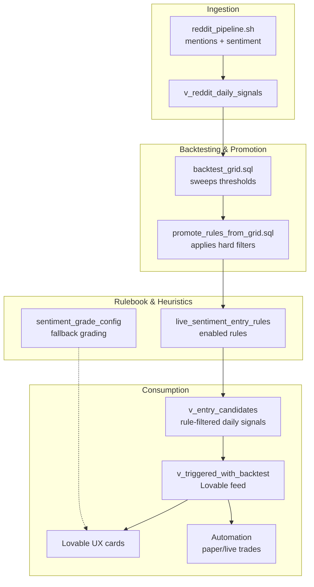

# Recommending Trades

This note explains how a daily Reddit signal becomes a promoted rule, how those rules are filtered, and how everything surfaces inside the Lovable UI.

## 1. Signals → Daily Aggregates
1. `reddit_pipeline.sh` fetches posts/comments, builds mentions, and scores them (GPT model output).  
2. `v_reddit_daily_signals` aggregates per `(trade_date, symbol)`:
   - `n_mentions`, `avg_score`, `used_score` (currently identical).
   - Only mentions that have a row in `reddit_sentiment` contribute; no model filter is applied yet.

This table is the raw sentiment feed. On its own it does not gate signals.

## 2. Backtesting & Rule Discovery
To turn daily averages into rules, we run the **backtesting pipeline** (`BACKTESTING_PIPELINE.md`):

- **Candidate view** (`v_entry_candidates`):
  - Joins the daily signals to the *current* production rulebook (`live_sentiment_entry_rules`).
  - Requires `n_mentions ≥ min_mentions` and `used_score` to clear the rule’s `pos_thresh` (or fall below for shorts).
  - Yields per-day symbol candidates with computed `margin = used_score - pos_thresh` (or mirrored for shorts).

- **Grid backtest** (`backtest_grid.sql`):
  - Sweeps `min_mentions` / `pos_thresh` across horizons & sides.  
  - Persists full diagnostics (train/valid sharpe, win rate, edges) and writes winners into `backtest_sweep_results`.

- **Promotion** (`promote_rules_from_grid.sql`):
  - Reads the sweep winners and applies *hard filters* (min trades, win rate, sharpe, robustness).  
  - Upserts the survivors into `live_sentiment_entry_rules` with full metadata (start/end window, stats, notes).  
  - `is_enabled` defaults to `true`; disabling a row keeps the metadata but stops live triggers.

> **Why this matters**: the “hard filters” live in SQL so that future runs can diff/track what changed. Promotion is the only supported way to mutate the rulebook at scale.

## 3. Rulebook vs. Heuristics
Two data sets gate trades:

1. **`live_sentiment_entry_rules`** — authoritative trading rules.  
   - Keyed by `(model_version, symbol, horizon, side)`.  
   - Fields: `min_mentions`, `pos_thresh`, `use_weighted`, `min_conf`, plus diagnostics.  
   - Used by pipelines and automation to decide if a symbol can trigger a paper/live trade.  
   - If the rule is missing or `is_enabled = false`, nothing can trigger—even if sentiment looks great.

2. **`sentiment_grade_config`** — UX grading fallback (“strong / moderate / weak”).  
   - Contains generic thresholds (e.g. “Strong if Sharpe ≥ 1.25 & trades ≥ 6”).  
   - Indexed by `(model_version, horizon, side)` plus `*` wildcards.  
   - Used only for presentation in Lovable when a specific rule is missing/disabled.

### Interaction
- When a new daily signal is evaluated, we first ask: *“Is there an enabled rule in `live_sentiment_entry_rules` for this symbol/horizon/side?”*  
  - **Yes** → apply that rule’s thresholds (`min_mentions`, `pos_thresh`, `min_conf`). If the candidate clears them, the pipeline may trigger a trade and the UX shows the rule-specific grade/notes.  
  - **No** → fall back to `sentiment_grade_config` to produce an informational grade. The card can still appear in the UI if the generic thresholds are met, but no automated trade fires.

This split allows analysts to keep seeing symbols (via heuristics) while holding back automated trades until a rule passes backlit testing + promotion.

## 4. How Lovable Uses the Data
Inside Lovable:

1. The UX reads `v_triggered_with_backtest` (which depends on `v_entry_candidates`, the rulebook, and backtest summaries).  
2. If a rule is enabled and the candidate passes its thresholds:
   - The card shows as actionable (Strong/Moderate per rule).  
   - Back-end automation (paper trades, alerts) checks `live_sentiment_entry_rules` to trigger entries.
3. If no rule is enabled:
   - The UX still grades using `sentiment_grade_config` (that’s where the “* wildcards” live).  
   - Cards are informational only; no paper/live trade is created because the automation doesn’t see an enabled rule entry.

## 5. Why Promote from Grid?
- **Repeatability**: the grid backtest + promotion script provides a consistent promotion flow; hard filters are embedded in SQL so we can audit and rerun.  
- **Versioning**: each promotion captures the window/model version used, so `live_sentiment_entry_rules` isn’t just a bag of overrides—it’s a historical record.  
- **Automation readiness**: Lovable and the pipelines only trust rules that have passed through promotion. Direct edits are possible, but discouraged because they skip validation.

## 6. Practical Workflow
1. Run the scoring pipeline (collect mentions + LLM sentiment). ∙  
2. Aggregate signals (`v_reddit_daily_signals`). ∙  
3. Backtest grid across the lookback. ∙  
4. Promote filtered winners → `live_sentiment_entry_rules`. ∙  
5. Seed trades (`seed_paper_trades_rules_only.sh`) to exercise new rules. ∙  
6. Review Lovable cards and paper trades. Disable any rules that misbehave, or iterate promotions.

## 7. FAQ
- **“Why am I only seeing GOOGL?”**  
  Because no other symbol currently has an enabled row in `live_sentiment_entry_rules`. Add more via promotion or manual inserts.

- **“Can’t we just rely on the heuristics table?”**  
  Heuristics (`sentiment_grade_config`) are for UX grading. They do not trigger automation. You still need a real rule to fire trades.

- **“Do we ever use the backup rules?”**  
  `live_sentiment_entry_rules_backup` stores the parameter weights you used when promoting (confidence, recency, sample caps…). It’s reference metadata; nothing in the pipeline reads those rows today. If you want a fallback, you’d need to seed those values back into the live table manually or via a scripted restore.

---

That’s the current end-to-end rationale. If we decide to add default rules or model-specific daily views later, we should update both this doc and the SQL to keep Lovable, backtests, and automation aligned.

## 2025-10-07 – Confidence Fixes & "Extra Strong" Exploration

**What we learned**
- `v_entry_candidates` was returning `NULL` confidence even with fully scored mentions; patching `v_reddit_daily_signals` to average confidence and bubbling it through the candidate view resolved the UX “null confidence” issue.
- Lovable’s fallback text was pulling `grade` directly (often `NULL`); switching to the existing `confidence_label` keeps cards aligned with the data we surface.
- Many high-confidence candidates lack a `backtest_sweep_results` shard or fail Sharpe / win-rate thresholds, so an "extra strong" tier should stay tied to backtested edges.

**Next actions**
- [ ] Run targeted grid backtests (`run_grid.sh`) for symbols currently missing shards (e.g. `HOOD`, `GOOGL`, `SOFI`) so active rules carry Sharpe / win-rate diagnostics.
- [ ] Add an "extra strong" flag in `fn_recommended_trades_conf` once shards exist (current proposal: confidence ≥ 0.80, margin ≥ 0.12, Sharpe ≥ 0.60, win-rate ≥ 0.65, trades ≥ 12 — revisit after fresh backtests).
- [ ] Schedule nightly grid runs (cron/GitHub Action/Supabase job) so new or adjusted rules immediately gain supporting shards.
- [ ] Update Lovable copy to surface the new tier explicitly (“Extra Strong – highest conviction, backtested”).

Keep this section in sync as we iterate on the thresholds or automation.

## 2025-10-07 – Extra Strong Threshold Review (Evening)

**Status update**
- Targeted grid runs now exist for GOOG, HOOD, SOFI, ASTS, AMD, TSLA, NVDA, PLTR, RUN, COIN, COST, NET, and PATH (SQL filters in `backtest_grid.sql` now honor `SYMBOLS`).
- 120-day base vs. extra-strong comparison still shows the "extra strong" cohort too small (3 closed 1d trades, 1 closed 5d trade) and underperforming base.
- Weekly cumulative returns highlight base-strong trades compounding steadily (~27% over four months on the 1d horizon) while extra-strong entries remain negative due to tiny sample size.

**Decisions**
- Keep the tighter gate (confidence ≥ 0.80, margin ≥ 0.12, Sharpe ≥ 0.60, win ≥ 0.65, trades ≥ 12). We’ll revisit once extra-strong trades exceed ~15 closed positions per horizon.
- Hold off on adding an “Extra Strong” label in Lovable until we see a meaningful sample and demonstrable uplift.
- Continue nightly/targeted grid backtests so shards keep pace with new rule thresholds; rerun the cohort analysis after more trades close.

**To monitor**
- Logged SQL snippets for cumulative-return checks (see conversation 2025-10-07). Consider standing up a lightweight reporting notebook or Supabase chart so we don’t rely on ad-hoc psql dumps.
- Revisit the extra-strong concept once data volume or newer rules supply enough closed trades to evaluate the uplift meaningfully.
- TODO (Lovable backtesting): rebuild a front-end flow that runs the new grid/shard backtests. The old “Sentiment Backtesting” manual runner will be removed, so we need a replacement before re-exposing backtesting controls.
